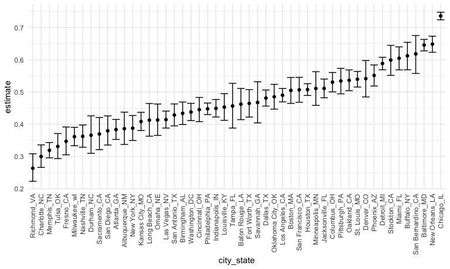
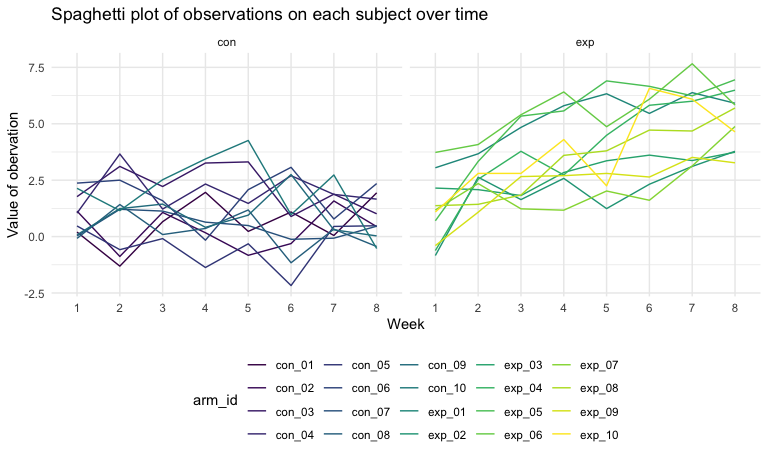
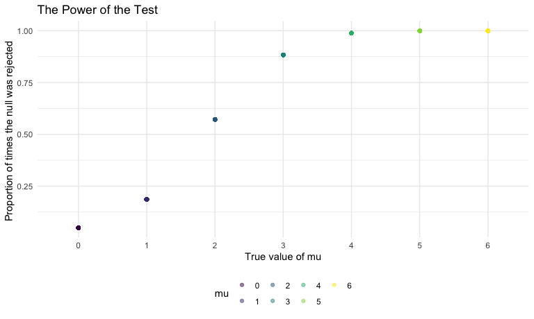

p8105\_hw5\_cl4044
================
Chenxi Liu
11/14/2020

## Problem 1

Read in the data.

``` r
homicide_df = 
  read_csv("homicide_data/homicide-data.csv") %>% 
  mutate(
    city_state = str_c(city, state, sep = "_"),
    resolved = case_when(
      disposition == "Closed without arrest" ~ "unsolved",
      disposition == "Open/No arrest"        ~ "unsolved",
      disposition == "Closed by arrest"      ~ "solved",
    )
  ) %>% 
  select(city_state, resolved) %>% 
  filter(city_state != "Tulsa_AL")
```

    ## Parsed with column specification:
    ## cols(
    ##   uid = col_character(),
    ##   reported_date = col_double(),
    ##   victim_last = col_character(),
    ##   victim_first = col_character(),
    ##   victim_race = col_character(),
    ##   victim_age = col_character(),
    ##   victim_sex = col_character(),
    ##   city = col_character(),
    ##   state = col_character(),
    ##   lat = col_double(),
    ##   lon = col_double(),
    ##   disposition = col_character()
    ## )

Let’s look at this a bit

``` r
aggregate_df = 
  homicide_df %>% 
  group_by(city_state) %>% 
  summarize(
    hom_total = n(),
    hom_unsolved = sum(resolved == "unsolved")
  )
```

    ## `summarise()` ungrouping output (override with `.groups` argument)

Can I do a prop test for a single city?

``` r
prop.test(
  aggregate_df %>% filter(city_state == "Baltimore_MD") %>% pull(hom_unsolved), 
  aggregate_df %>% filter(city_state == "Baltimore_MD") %>% pull(hom_total)) %>% 
  broom::tidy()
```

    ## # A tibble: 1 x 8
    ##   estimate statistic  p.value parameter conf.low conf.high method    alternative
    ##      <dbl>     <dbl>    <dbl>     <int>    <dbl>     <dbl> <chr>     <chr>      
    ## 1    0.646      239. 6.46e-54         1    0.628     0.663 1-sample… two.sided

Try to iterate ……..

``` r
results_df = 
  aggregate_df %>% 
  mutate(
    prop_tests = map2(.x = hom_unsolved, .y = hom_total, ~prop.test(x = .x, n = .y)),
    tidy_tests = map(.x = prop_tests, ~broom::tidy(.x))
  ) %>% 
  select(-prop_tests) %>% 
  unnest(tidy_tests) %>% 
  select(city_state, estimate, conf.low, conf.high)
```

``` r
results_df %>% 
  mutate(city_state = fct_reorder(city_state, estimate)) %>% 
  ggplot(aes(x = city_state, y = estimate)) +
  geom_point() + 
  geom_errorbar(aes(ymin = conf.low, ymax = conf.high)) + 
  theme(axis.text.x = element_text(angle = 90, vjust = 0.5, hjust = 1))
```



``` r
homicide_df = 
  read_csv("homicide_data/homicide-data.csv") %>% 
  mutate(
    city_state = str_c(city, state, sep = "_"),
    resolved = case_when(
      disposition == "Closed without arrest" ~ "unsolved",
      disposition == "Open/No arrest"        ~ "unsolved",
      disposition == "Closed by arrest"      ~ "solved",
    )
  ) %>% 
  select(city_state, resolved) %>% 
  filter(city_state != "Tulsa_AL") %>% 
  nest(data = resolved)
```

    ## Parsed with column specification:
    ## cols(
    ##   uid = col_character(),
    ##   reported_date = col_double(),
    ##   victim_last = col_character(),
    ##   victim_first = col_character(),
    ##   victim_race = col_character(),
    ##   victim_age = col_character(),
    ##   victim_sex = col_character(),
    ##   city = col_character(),
    ##   state = col_character(),
    ##   lat = col_double(),
    ##   lon = col_double(),
    ##   disposition = col_character()
    ## )

## Problem 2

Iterate and import the longitudinal dataset

``` r
path_df = 
  tibble(
    path = list.files("lda_data"),
  ) %>% 
  mutate(
    path = str_c("lda_data/", path),
    data = map(.x = path, ~read_csv(.x))
  )
```

Tidy and manipulate the results

``` r
lda_df = path_df %>%
  unnest(data) %>%
  mutate(
    name = str_extract(path, "(exp_[0-9][0-9]|con_[0-9][0-9])"),
  ) %>%
  separate(name, into = c("arm","id"), sep= "_") %>%
  pivot_longer(week_1:week_8, names_to = "week", values_to = "value", names_prefix = "week_") %>%
  select(-path) %>%
  mutate(arm_id = str_c(arm, id, sep= "_"))
```

Make a spaghetti plot showing observations on each subject over time

``` r
lda_df %>%
  ggplot(
    aes(x = week,
        y = value,
        group = arm_id,
        color = arm_id
        )
  ) +
  geom_line() +
  facet_grid(. ~ arm) +
  labs(x = "Week", y = "Value of obervation", title = "Spaghetti plot of observations on each subject over time")
```



According to the spaghetti plot above, the observation values of
participants in the control group overall stay the same over 8 weeks.
The observation values of participants in the experimental group
increased over 8 weeks

## Problem 3

Implement a `t.test` function that takes \(\mu\) and returns the result
of t test.

``` r
sim_t_test = function(n = 30, mu = 0, sigma = 5){
  sim_data = tibble(
    x = rnorm(n, mean = mu, sd = sigma)
  ) 
    
  test_data = t.test(sim_data, mu = 0, conf.level = 0.95)
  
  sim_data %>% 
    summarize(
      mu_hat =pull(broom::tidy(test_data),estimate),
      p_val = pull(broom::tidy(test_data),p.value)
    )
}
```

Repeat the t test for 5000 times for \(\mu=\{0,1,2,3,4,5,6\}\).

``` r
sim_res = 
  tibble(
    mu = c(0:6)
    ) %>%
  mutate(outputs = map(.x = mu, ~rerun(50, sim_t_test(mu = .x))),
         estimate = map(outputs, bind_rows),
         mu = as.factor(mu)) %>%
  unnest(estimate) %>%
  select(-outputs)
```

Make a plot showing the proportion of times the null was rejected (the
power of the test) on the y axis and the true value of \(\mu\) on the x
axis.

``` r
sim_res %>%
  group_by(mu) %>%
  mutate(total = n(),
         rej_count = sum(p_val<0.05),
         rej_prop = rej_count/total) %>%
  ggplot(aes(x = mu, y = rej_prop, color = mu, group = mu)) +
  geom_point(alpha = .5) +
  ggtitle("The Power of the Test")+
  ylab("Proportion of times the null was rejected ")+
  xlab("True value of mu")
```



According to the plot above, I find that as the true value of \(\mu\)
further away from 0, the power of the test increases and eventually
approaches 1.
